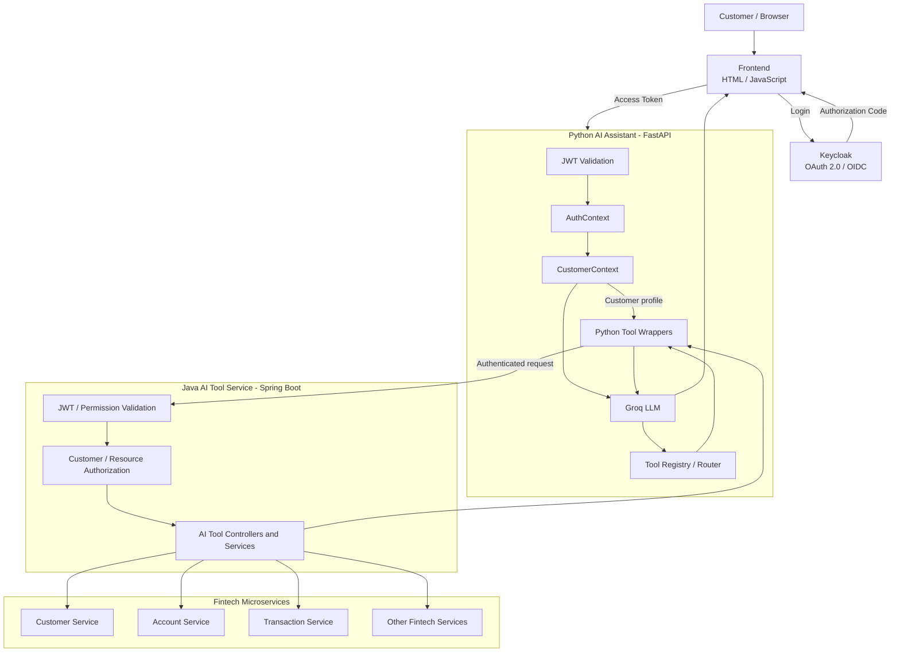
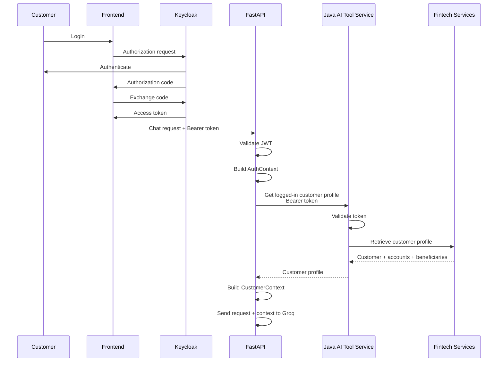

# AI-Powered Personal Banking Assistant

An AI-powered personal banking assistant built with **Python, FastAPI, Groq LLM, Keycloak, and Spring Boot**. The assistant provides a conversational interface to a fintech application, allowing authenticated customers to ask banking-related questions, retrieve account and transaction information, and access customer-specific financial context.

The assistant separates **AI reasoning from financial business logic and authorization**. The LLM selects tools based on customer intent, while the Java AI Tool Service controls access to the underlying fintech services.

## Table of Contents

* [Overview](#overview)
* [Architecture](#architecture)
* [Technology Stack](#technology-stack)
* [Core Components](#core-components)
* [Authentication and Customer Context Flow](#authentication-and-customer-context-flow)
* [CustomerContext](#customercontext)
* [AI Tool Calling](#ai-tool-calling)
* [Backend AI Tool APIs](#backend-ai-tool-apis)
* [Security Design](#security-design)
* [Example Interactions](#example-interactions)
* [Future Enhancements](#future-enhancements)

---

## Overview

The assistant combines a large language model with authenticated backend tools to provide a conversational personal banking experience.

### Current capabilities

* Answer general personal banking and financial domain questions.
* Authenticate customers using Keycloak.
* Retrieve the logged-in customer's profile.
* Retrieve account summaries.
* Retrieve beneficiary information.
* Retrieve account balances.
* Retrieve transaction history.
* Retrieve individual transaction details.
* Use customer-specific context during conversations.
* Select backend tools based on natural-language requests.
* Propagate the authenticated customer's bearer token to backend services.
* Enforce authorization and customer ownership at the backend boundary.

The initial implementation focuses on **read-only banking capabilities**. Financial actions such as transfers and withdrawals can be added later with explicit confirmation and stronger transaction controls.

---

## Architecture



### Architectural principle

> **The LLM decides which tool can help answer a question; the backend decides whether the requested operation is authorized and executes the business logic.**

The responsibilities are deliberately separated:

* **Keycloak** authenticates the customer and issues the access token.
* **FastAPI** manages the AI conversation, authentication context, customer context, and tool execution.
* **Groq LLM** understands the customer's intent and selects available tools.
* **Python tool wrappers** translate tool calls into authenticated HTTP requests.
* **Java AI Tool Service** provides the controlled boundary into the fintech application.
* **Fintech microservices** remain responsible for financial business rules and source-of-truth data.

---

## Technology Stack

| Component            | Technology                           |
| -------------------- | ------------------------------------ |
| AI application       | Python, FastAPI                      |
| Language model       | Groq LLM                             |
| Authentication       | Keycloak, OAuth 2.0 / OpenID Connect |
| Frontend             | HTML, JavaScript                     |
| Backend integration  | Spring Boot                          |
| API communication    | HTTP / REST, JSON                    |
| Token format         | JWT                                  |
| Backend architecture | Microservices                        |

---

## Core Components

### 1. Frontend

The frontend is a lightweight HTML/JavaScript application.

Responsibilities:

* Initiate Keycloak login.
* Handle the authentication callback.
* Obtain the access token.
* Send the access token with requests to FastAPI.
* Display assistant responses.

The frontend does not provide trusted `customerId` or account information to the backend.

The authenticated identity is established from the Keycloak access token.

---

### 2. Keycloak

Keycloak is used as the identity provider for the fintech application.

The customer authenticates through the configured fintech Keycloak client.

After successful authentication:

```text
Customer
   |
   | Login
   v
Keycloak
   |
   | Authorization Code
   v
Frontend
   |
   | Token Exchange
   v
Access Token
```

The access token is subsequently supplied to FastAPI using the HTTP `Authorization` header:

```http
Authorization: Bearer <access_token>
```

---

### 3. FastAPI AI Assistant

FastAPI is the main AI application layer.

Responsibilities:

* Validate incoming JWTs.
* Establish authenticated customer identity.
* Build `AuthContext`.
* Retrieve customer profile information.
* Build `CustomerContext`.
* Maintain conversation/session context.
* Communicate with Groq.
* Register and execute AI tools.
* Propagate the customer's bearer token to the Java AI Tool Service.

FastAPI does not implement core financial business rules.

---

### 4. AuthContext

`AuthContext` represents the authenticated request.

Conceptually:

```python
@dataclass
class AuthContext:
    customer_id: str
    roles: list[str]
    permissions: list[str]
    session_id: str
    access_token: str
```

The context is derived from the **validated Keycloak JWT**.

The access token is kept as authentication information and is not exposed to the LLM.

---

### 5. Customer Profile

After authentication, FastAPI retrieves the logged-in customer's profile through the Java AI Tool Service.

The profile provides domain-specific information required by the assistant, including:

* Customer information.
* Account summary.
* Account identifiers.
* Account type and related summary information.
* Beneficiary details.

This allows FastAPI to build a useful customer-specific context without requiring the LLM to discover basic customer information through multiple calls.

Conceptually:

```text
Keycloak JWT
     |
     | customer identity
     v
FastAPI
     |
     | GET customer profile
     v
Java AI Tool Service
     |
     v
Customer Service / Account Service
     |
     v
Customer Profile
     |
     +── Customer details
     +── Account summary
     +── Account IDs
     +── Beneficiaries
```

---

## Authentication and Customer Context Flow

The complete authentication and initialization flow is:



### CustomerContext construction

The `CustomerContext` combines:

1. **Identity information from Keycloak**
2. **Domain information from the fintech backend**

For example:

```python
@dataclass
class CustomerContext:
    customer_id: str
    account_ids: list[str]
    default_account_id: str | None
    beneficiaries: list
    account_summary: list
    session_id: str
    roles: list[str]
    permissions: list[str]
```

The important separation is:

```text
Keycloak
   |
   +-- customerId
   +-- roles
   +-- permissions
   +-- sessionId
   |
   v
AuthContext


Fintech Backend
   |
   +-- accounts
   +-- account summary
   +-- beneficiaries
   |
   v
CustomerContext
```

`CustomerContext` is application context and must **not** be treated as the source of authorization.

The Java AI Tool Service independently validates authorization when accessing protected resources.

---

## AI Tool Calling

The assistant initially exposes a small set of read-only tools.

### Current tools

| Tool                                | Purpose                                                                           |
| ----------------------------------- | --------------------------------------------------------------------------------- |
| `get_customer_profile()`            | Retrieve the authenticated customer's profile, account summary, and beneficiaries |
| `get_account_balance()`             | Retrieve the balance of an account                                                |
| `get_transactions(from, to, limit)` | Retrieve transaction history                                                      |
| `get_transaction(transaction_id)`   | Retrieve details of a specific transaction                                        |

The customer profile is normally retrieved during assistant initialization or when the context needs to be refreshed.

The other tools are invoked by the LLM when required to answer a customer request.

---

## Customer Profile Tool

The profile endpoint is particularly important because it initializes the assistant's customer-specific context.

Conceptually:

```text
Authenticated customer
        |
        v
get_customer_profile()
        |
        v
Customer Profile
        |
        +-- Customer details
        +-- Accounts
        +-- Account summary
        +-- Beneficiaries
        |
        v
CustomerContext
```

Once this context is available, the LLM can understand requests such as:

> "What's my balance?"

> "Show me my recent transactions."

> "What accounts do I have?"

> "Who are my beneficiaries?"

> "Show me transactions from my savings account."

The assistant can use the account and beneficiary information already present in the context and invoke additional tools when detailed information is required.

---

## Backend AI Tool APIs

The Java AI Tool Service exposes assistant-oriented APIs rather than exposing the complete internal fintech API surface.

### Get logged-in customer profile

```http
GET /ai-tools/customer/profile
Authorization: Bearer <access_token>
```

The endpoint returns the authenticated customer's profile together with account summary and beneficiary information.

Example conceptual response:

```json
{
  "customerId": "11111111-1111-1111-1111-111111111111",
  "name": "John Doe",
  "accounts": [
    {
      "accountId": "22222222-2222-2222-2222-222222222222",
      "accountType": "SAVINGS",
      "currency": "INR",
      "balance": 45230.50
    }
  ],
  "beneficiaries": [
    {
      "beneficiaryId": "33333333-3333-3333-3333-333333333333",
      "name": "Jane Doe"
    }
  ]
}
```

The exact response structure can evolve independently of the LLM.

### Get account balance

```http
GET /ai-tools/accounts/{accountId}/balance
Authorization: Bearer <access_token>
```

Example:

```http
GET http://localhost:8088/ai-tools/accounts/22222222-2222-2222-2222-222222222222/balance
Authorization: Bearer <access_token>
```

### Get transactions

```http
GET /ai-tools/transactions?accountId={accountId}&from={from}&to={to}&limit={limit}
Authorization: Bearer <access_token>
```

Example:

```http
GET http://localhost:8088/ai-tools/transactions?accountId=22222222-2222-2222-2222-222222222222&from=2024-01-01T00:00:00Z&to=2026-12-31T23:59:59Z&limit=10
Authorization: Bearer <access_token>
```

### Get transaction details

```http
GET /ai-tools/transactions/{transactionId}
Authorization: Bearer <access_token>
```

Example:

```http
GET http://localhost:8088/ai-tools/transactions/11111111-1111-1111-1111-111111111111
Authorization: Bearer <access_token>
```

---

## Tool Execution Flow

For a request such as:

> **"Show me my last 5 transactions."**

The flow is:

```text
Customer
   |
   v
FastAPI
   |
   | CustomerContext
   v
Groq
   |
   | get_transactions(limit=5)
   v
Python Tool Wrapper
   |
   | accountId from CustomerContext
   | Bearer token
   v
Java AI Tool Service
   |
   | Validate JWT
   | Validate account ownership
   | Validate permission
   v
Transaction Service
   |
   v
Transaction data
   |
   v
Python Tool
   |
   v
Groq
   |
   v
Natural-language response
```

The LLM does not directly communicate with the Transaction Service.

---

## Security Design

Security is enforced independently of the LLM.

### Authentication

* Keycloak is the identity provider.
* The frontend uses OpenID Connect.
* JWT access tokens are validated by FastAPI.
* The Java AI Tool Service independently validates the bearer token.
* Token issuer, signature, expiration, and audience are validated according to the configured Keycloak client.

### Authorization

The Java AI Tool Service is the backend authorization boundary.

For example:

```text
Authenticated customer
        |
        v
Does customer have required permission?
        |
        v
Does customer own requested account?
        |
        v
Does customer have access to requested transaction?
        |
        v
Call fintech service
```

The assistant must never assume that a resource is accessible simply because the LLM requested it.

### Token propagation

The initial implementation propagates the authenticated customer's access token:

```text
Browser
   |
   | Bearer token
   v
FastAPI
   |
   | Bearer token
   v
Java AI Tool Service
   |
   v
Fintech Services
```

The token is not included in:

* LLM prompts.
* Tool descriptions.
* Tool results.
* Logs.
* Customer-facing responses.

### CustomerContext is not authorization

`CustomerContext` may contain:

```text
customerId
accountIds
beneficiaries
roles
permissions
```

However, it should be treated as **application context**, not as proof that an operation is authorized.

The Java backend independently verifies authorization before returning protected information.

---

## Example Interactions

### 1. Customer profile

**Customer:**

> "What accounts do I have?"

The assistant can use the customer profile already retrieved during context initialization.

```text
Customer
   |
   v
CustomerContext
   |
   v
Groq
   |
   v
Account information
```

### 2. Balance

**Customer:**

> "What's my current balance?"

The LLM invokes:

```text
get_account_balance()
```

The Python wrapper resolves the appropriate account from `CustomerContext`.

The Java AI Tool Service validates access and retrieves the balance from the Account Service.

### 3. Transactions

**Customer:**

> "Show me my last 10 transactions."

The LLM invokes:

```text
get_transactions(limit=10)
```

The Python wrapper supplies the appropriate account context, and the Java service verifies account ownership before retrieving the transactions.

### 4. Beneficiaries

**Customer:**

> "Who are my beneficiaries?"

The assistant can answer from the authenticated customer's profile context.

### 5. Transaction explanation

**Customer:**

> "Explain transaction 11111111-1111-1111-1111-111111111111."

The assistant invokes:

```text
get_transaction(transaction_id)
```

The Java service verifies that the transaction belongs to a resource accessible by the authenticated customer before returning its details.

---

## Example System Prompt

The LLM is provided with behavioral instructions similar to:

```text
You are a personal banking assistant.

You help the authenticated customer understand their own
financial information.

Available capabilities:
- Retrieve customer profile information
- Retrieve account balances
- Retrieve transaction history
- Retrieve transaction details

Rules:
1. Use tools when backend data is required.
2. Never invent financial information.
3. Treat backend responses as the source of truth.
4. Only discuss information belonging to the authenticated customer.
5. Do not expose internal identifiers unless required.
6. Do not make authorization decisions.
7. Do not perform financial actions unless an explicitly
   authorized action tool is available.
8. If required information is unavailable, clearly state that.
9. Preserve the currency and values returned by the backend.
```

The prompt controls **LLM behavior**.

Backend services remain responsible for **security and authorization**.

---

## Future Enhancements

The architecture can be extended incrementally.

### Additional read-only capabilities

* Account discovery and multi-account support.
* Spending analysis.
* Financial insights.
* Transaction categorization.
* Fraud analysis and explanations.
* Transaction/Saga status.
* Notification history.

### Financial actions

Actions such as:

* Transfer money.
* Add beneficiary.
* Deposit.
* Withdraw.

should be introduced separately from read-only tools.

A financial action should follow a confirmation flow:

```text
Customer
   |
   | "Transfer ₹5,000 to Jane"
   v
LLM
   |
   | Prepare transfer
   v
Backend validation
   |
   v
Assistant
   |
   | "Transfer of ₹5,000 to Jane is ready.
   |  Please confirm."
   v
Explicit customer confirmation
   |
   v
Execute action
```

Financial actions should additionally use:

* Idempotency.
* Strong authorization.
* Validation.
* Audit logging.
* Transaction limits.
* Explicit confirmation.

---

## Design Summary

The architecture maintains a clear separation of responsibilities:

| Layer                    | Responsibility                                                               |
| ------------------------ | ---------------------------------------------------------------------------- |
| **Keycloak**             | Authentication and token issuance                                            |
| **Frontend**             | Login, callback handling, and user interaction                               |
| **FastAPI**              | AI application, authentication context, customer context, and tool execution |
| **AuthContext**          | Authenticated identity and security information                              |
| **CustomerContext**      | Customer-specific domain context                                             |
| **Groq LLM**             | Natural-language understanding and tool selection                            |
| **Python Tool Wrappers** | Controlled tool execution and backend integration                            |
| **Java AI Tool Service** | Authorization boundary and fintech integration                               |
| **Fintech Services**     | Financial business rules and source-of-truth data                            |

The resulting flow is:

```text
Keycloak
    |
    | Access Token
    v
FastAPI
    |
    +-- AuthContext
    |
    +-- Customer Profile
    |       |
    |       +-- Accounts
    |       +-- Account Summary
    |       +-- Beneficiaries
    |
    v
CustomerContext
    |
    v
Groq LLM
    |
    v
Python Tool Wrapper
    |
    | Bearer Token + Tool Parameters
    v
Java AI Tool Service
    |
    | Authentication
    | Authorization
    | Resource Ownership
    v
Fintech Microservices
```
